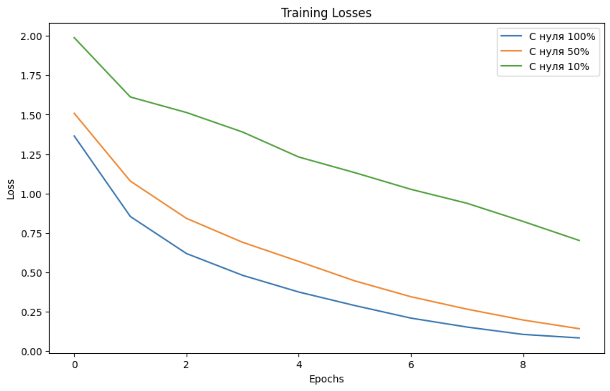
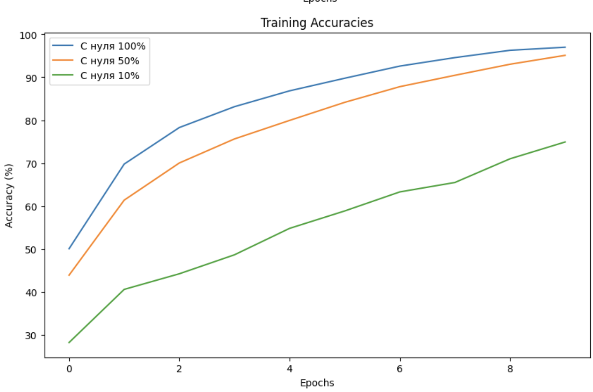

# Обработка и генерация изображений
## Домашнее задание № 3

- Задача: Множественная классификация.
- Датасет: CIFAR-10.
### Архитектура: ResNet-18

### График изменения функции потерь на обучении.

### График точности.

### Итоговая таблица с лучшими метриками:

| label           |   max_accuracy |   final_loss |
|:----------------|---------------:|-------------:|
| С нуля 100%   |         97.008 |    0.083886 |
| С нуля 50%     |         95.116 |    0.142293  |
| С нуля 10%     |         74.92  |    0.702148 |
| Pretrained 100% |         29.682 |    1.9436 |
| Pretrained 50%  |         28.776  |    1.9633   |
| Pretrained 10%  |         27.78  |    1.98043   |
