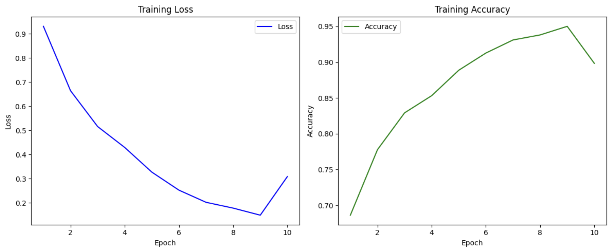
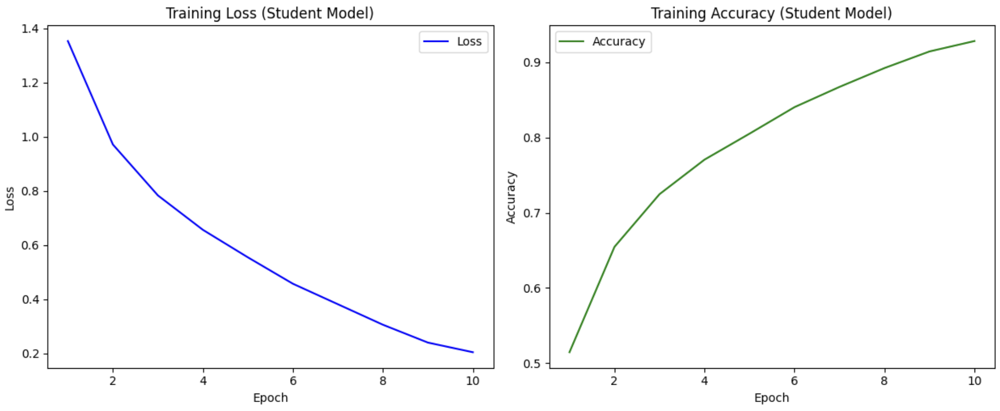
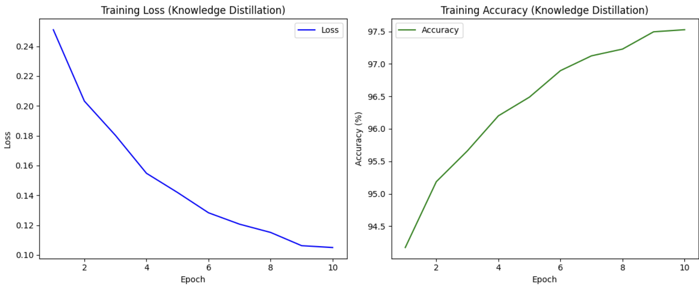
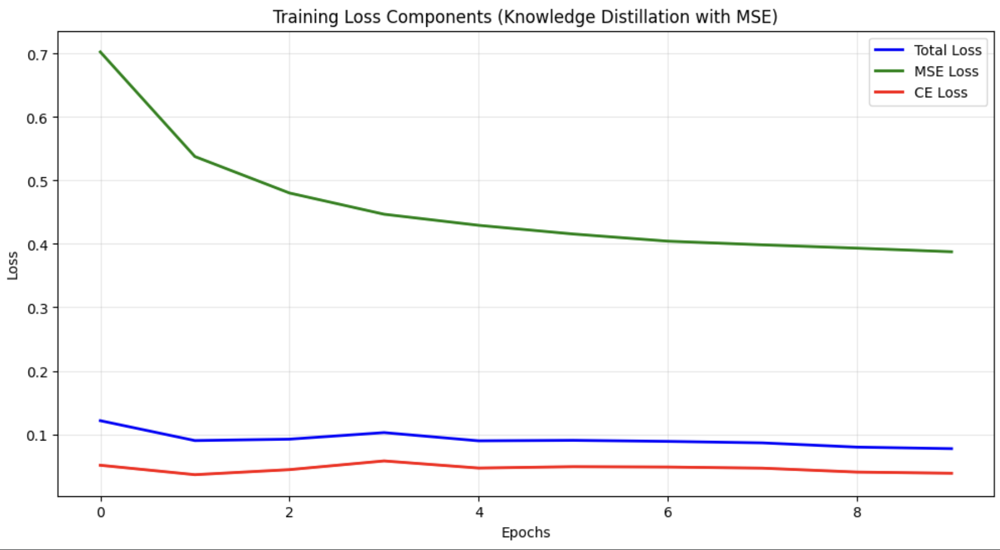

# Обработка и генерация изображений
## Домашнее задание №4

### Экспериментальная установка
- **Датасет**: CIFAR-10
- **Архитектура модели-учителя**: ResNet50
- **Архитектура модели-ученика**: ResNet18

### Процесс обучения моделей

#### Обучение модели-учителя

#### Обучение модели-ученика с нуля

#### Сравнение производительности
- **Модель-учитель**: 81.89% точности на тестовой выборке
- **Модель-ученик**: 74.59% точности на тестовой выборке

### Дистилляция знаний с Cosine Loss
Обучение ученика с использованием знаний учителя через cosine similarity loss:

### Расширенная дистилляция с регрессором
Для улучшения передачи знаний был добавлен регрессор на основе сверточного слоя (nn.Conv2d), который преобразует пространство признаков ученика к размерности учителя.

#### Результаты комплексной дистилляции
Совместное использование MSE Loss, CrossEntropy Loss и Total Loss:

### Анализ результатов
- **Total Loss**: стабильное уменьшение свидетельствует об успешной оптимизации модели
- **MSE Loss**: снижение показывает эффективное сближение представлений ученика и учителя
- **CrossEntropy Loss**: уменьшение демонстрирует улучшение классификационной способности ученика

### Ключевые выводы
Дистилляция знаний позволяет эффективно передавать знания от большой модели к меньшей, сохраняя при этом высокое качество классификации при значительном уменьшении вычислительной сложности.
