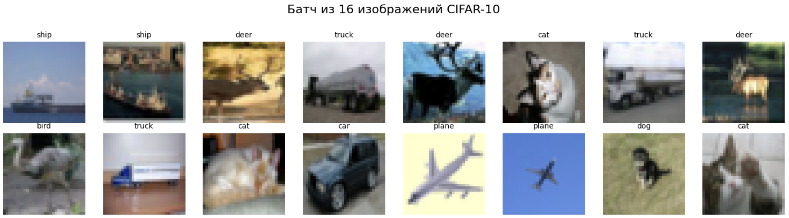
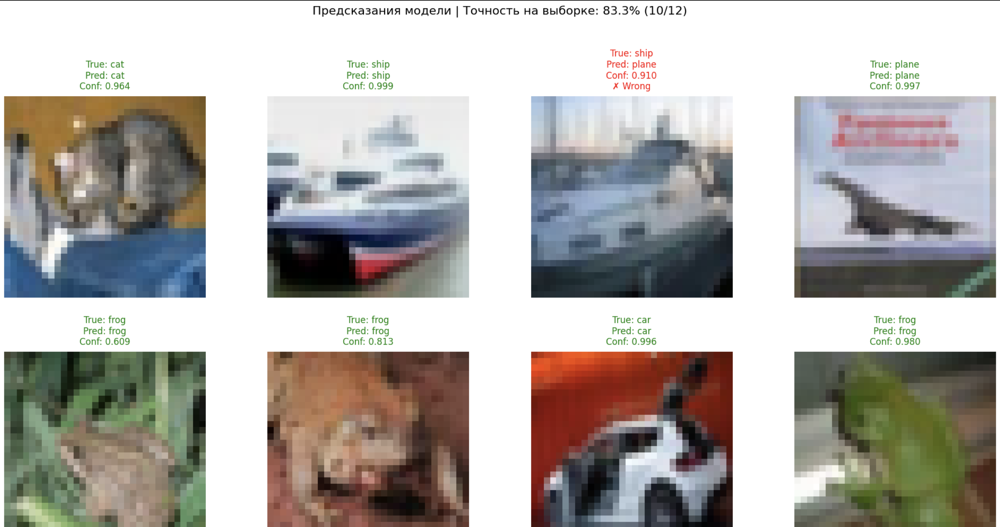
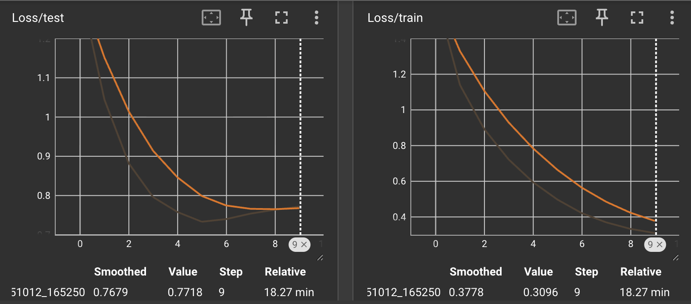
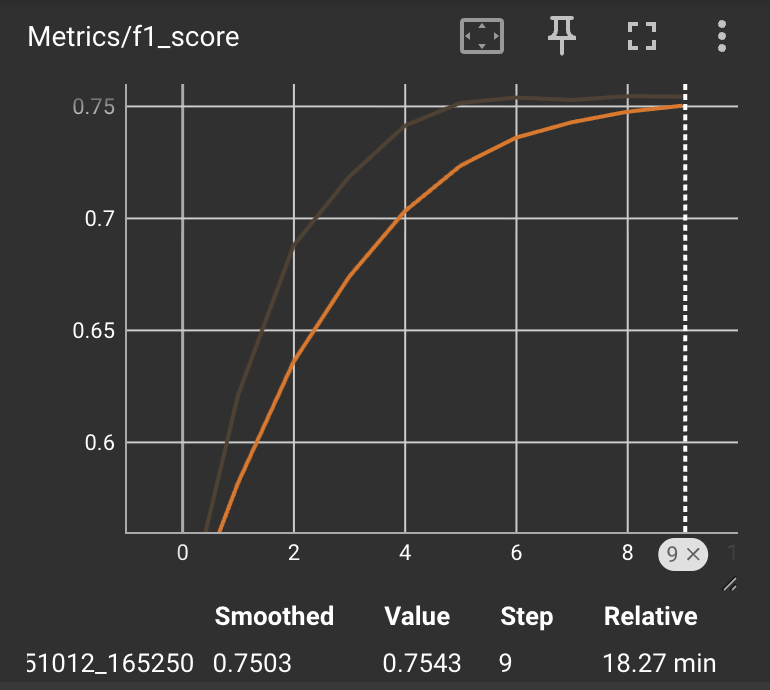
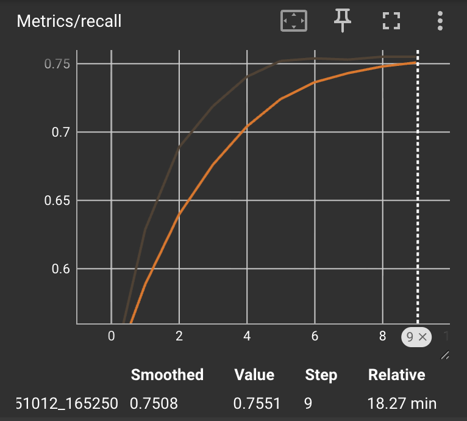
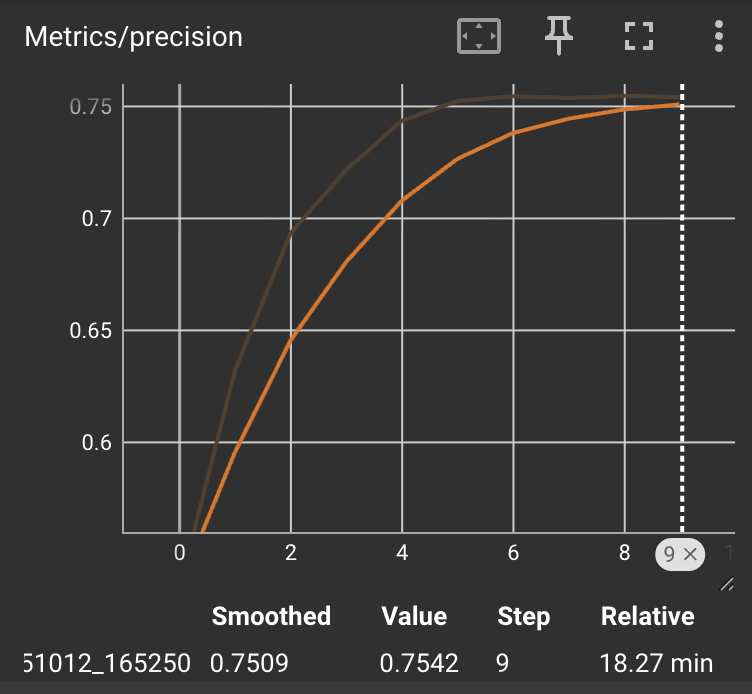

# Домашняя работа 1

## Задача: многоклассовая классификация

## Датасет: CIFAR-10
### Содержит 10 классов, каждая из которых представляет определённый класс объектов:
- Самолёты (airplane)
- Автомобили (automobile)
- Птицы (bird)
- Кошки (cat)
- Олени (deer)
- Собаки (dog)
- Лягушки (frog)
- Лошади (horse)
- Корабли (ship)
- Грузовики (truck)

### Количество изображений:
   - 60,000 изображений
   - Из них:
     - 50,000 изображений используются для обучения (train set).
     - 10,000 изображений отведены для тестирования (test set).

### Размер изображений:
   - Каждое изображение имеет размер 32x32 пикселя

### Пример батча изображений 

## Использованная архитектура нейросети: ResNet34

### Гиперпараметры обучения:
- оптимайзер: AdamW
- Learning rate: 0.001
- Scheduler: ExponentialLR
- Epoch: 10
- Batch: 16

### Результаты 

###  Пример работы модели 

### Метрики качества модели 
По всем классам:

| Метрика | Значение |
|-------|----------|
| precision | 0.7547   |
| recall   | 0.7551  |
| f1 score  | 0.7546   |

Accuracy для каждого класса:
| Класс | Точность |
|-------|----------|
| plane | 78.10 %   |
| car   | 85.70 %   |
| bird  | 66.90 %  |
| cat   | 55.70 %  |
| deer  | 69.90 %   |
| dog   | 64.70 %  |
| frog  | 85.30 %   |
| horse | 78.40 %  |
| ship  | 88.40 %  |
| truck | 81.80 %  |

### Loss train и test в TensorBoard

 

### Метрики в TensorBoard

| F1                       | Recall                   | Precision              |
|--------------------------|--------------------------|------------------------|
|         |     |  |

---
